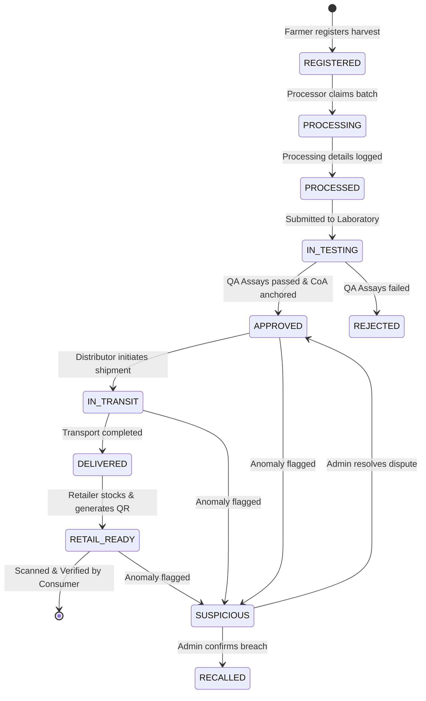

# 🌿 FloraChain — Blockchain-Based Botanical Traceability Platform

[](https://opensource.org/licenses/MIT)
[](https://soliditylang.org/)
[](https://sepolia.etherscan.io/address/0xFc06C5eeF51Cc050D2A663120E7d86745cF51745)
[](https://polygon.technology/)
[](https://spring.io/projects/spring-boot)
[](https://openjdk.org/)
[](https://react.dev/)
[](https://www.typescriptlang.org/)
[](https://tailwindcss.com/)
[](https://hardhat.org/)
[](https://web3j.io/)
[](https://www.postgresql.org/)
[](https://www.docker.com/)

**FloraChain** is an enterprise-grade, decentralized botanical supply chain provenance and anti-counterfeiting platform. It guarantees end-to-end transparency, regulatory compliance, and immutable quality verification for medicinal herbs, organic extracts, botanicals, and herbal health formulations from agricultural harvest to the end consumer.

---

## 🌐 Live On-Chain Smart Contract

| Parameter | Value |
| :--- | :--- |
| **Network** | **Ethereum Sepolia Testnet (Chain ID: `11155111`)** |
| **Contract Address** | [`0xFc06C5eeF51Cc050D2A663120E7d86745cF51745`](https://sepolia.etherscan.io/address/0xFc06C5eeF51Cc050D2A663120E7d86745cF51745) |
| **Explorer Link** | 🔗 [View on Etherscan](https://sepolia.etherscan.io/address/0xFc06C5eeF51Cc050D2A663120E7d86745cF51745) |
| **Supported Networks** | Localhost (`31337`), Ethereum Sepolia (`11155111`), Polygon Amoy (`80002`), Polygon PoS Mainnet (`137`) |

---

## 📑 Table of Contents

- [Key Highlights](#-key-highlights)
- [The Problem \& Solution](#-the-problem--solution)
- [System Architecture](#-system-architecture)
- [Supply Chain Lifecycle \& State Machine](#-supply-chain-lifecycle--state-machine)
- [Stakeholder Roles \& Dashboards](#-stakeholder-roles--dashboards)
- [Technology Stack Matrix](#-technology-stack-matrix)
- [Smart Contract Specification](#-smart-contract-specification)
- [Backend REST API Overview](#-backend-rest-api-overview)
- [Project Directory Structure](#-project-directory-structure)
- [Prerequisites](#-prerequisites)
- [Quick Start \& Development Guide](#-quick-start--development-guide)
  - [1. Running Locally (Zero-Config / Dev Mode)](#1-running-locally-zero-config--dev-mode)
  - [2. Deploying to Public Blockchain (Sepolia / Polygon)](#2-deploying-to-public-blockchain-sepolia--polygon)
  - [3. Full Stack Docker Deployment](#3-full-stack-docker-deployment)
- [Pre-Seeded Demo Credentials](#-pre-seeded-demo-credentials)
- [Testing \& Verification](#-testing--verification)
- [Security \& Data Integrity](#-security--data-integrity)
- [Roadmap](#-roadmap)
- [License](#-license)

---

## 🌟 Key Highlights

- **Immutable On-Chain Ledger**: Core supply chain milestones are anchored onto an EVM smart contract (`BotanicalTraceability.sol`), creating an unalterable audit trail.
- **Multi-Stakeholder Role-Based Access Control (RBAC)**: Secure multi-tenant architecture strictly partitioning operations for **Farmers**, **Processors**, **Laboratories**, **Distributors**, **Retailers**, and **Consortium Admins**.
- **Cryptographic Laboratory Proofs & IPFS Off-Chain Storage**: Full assay documentation, certificates of analysis (CoA), heavy metal assays, and microbial tests are cryptographically hashed and linked via Pinata IPFS CID references.
- **Consumer Instant Verification**: Public portal enabling consumers to scan a batch QR code or input a Batch ID to instantly view complete farm-to-shelf provenance, geo-coordinates, lab results, and blockchain transaction receipts without requiring crypto or a wallet.
- **Anti-Counterfeit & Anomaly Alerting**: Built-in suspicious batch flagging, multi-stage dispute reporting, and admin recall mechanisms.
- **Enterprise Spring Boot 3 Backend**: High-performance RESTful API with stateless JWT security, Web3j blockchain integration, H2 in-memory zero-config dev database, and PostgreSQL production readiness.
- **Premium Reactive UI/UX**: Built with React 18, Vite, TypeScript, and modern glassmorphic Tailwind CSS with animated milestone progress trackers and real-time blockchain telemetry.

---

## 🎯 The Problem & Solution

### ⚠️ Industry Challenges
1. **Adulteration & Counterfeiting**: High-value botanical extracts and medicinal herbs are vulnerable to unauthorized blending with synthetic fillers or low-grade substitutes.
2. **Centralized & Manipulable Records**: Paper logs and centralized relational databases can be retroactively altered, falsified, or lost.
3. **Fragmented Silos**: Farmers, extract processors, certified testing laboratories, cold-chain transporters, and retailers operate on disparate, non-interoperable tracking systems.
4. **Opaque Quality Assays**: Consumers and healthcare practitioners cannot verify the authenticity of printed organic, pesticide-free, or purity certificates.
5. **Slow Recall Response**: Tracing contaminated or substandard batches across complex international distribution networks can take weeks.

### 🛡️ The FloraChain Solution
```
[ 🧑🌾 Cultivator / Farmer ]
         │  Registers raw botanical harvest with geo-coordinates, yield & organic certs
         ▼
[ ⚙️ Extraction Processor ]
         │  Logs extraction method (CO2, solvent, milling), processing yield & loss %
         ▼
[ 🔬 Certified QA Laboratory ]
         │  Conducts purity (%), moisture (%), heavy metals & microbial assays + IPFS CoA
         ▼
[ 🚚 Cold-Chain Distributor ]
         │  Tracks transit telemetry, source/destination dispatch & delivery signatures
         ▼
[ 🏪 Licensed Retailer ]
         │  Receives verified stock, checks shelf readiness, generates batch QR code
         ▼
[ 📱 End Consumer / Patient ]
            Scans QR code -> Instant end-to-end cryptographic provenance & verified audit trail
```

---

## 🏗️ System Architecture

```
+-----------------------------------------------------------------------------------+
|                                 CLIENT LAYER                                      |
|  React 18 + TypeScript + Vite + Tailwind CSS + Lucide Icons + QR Scanner / Gen    |
+-----------------------------------------------------------------------------------+
                       │ (Ethers.js v6 / MetaMask)       │ (REST / JWT)
                       ▼                                 ▼
+------------------------------------+          +-----------------------------------+
|         BLOCKCHAIN LAYER           |          |         APPLICATION LAYER         |
|  • Ethereum Sepolia / Polygon Amoy |◄─────────┤  • Spring Boot 3.3.3 (Java 20)    |
|  • Smart Contract:                 |  Web3j   |  • Security & RBAC Enforcement   |
|    BotanicalTraceability.sol       | JSON-RPC |  • PostgreSQL / H2 Database       |
+------------------------------------+          +-----------------------------------+
                       │                                         │
                       └───────────────────┬─────────────────────┘
                                           ▼
                                +---------------------+
                                |   STORAGE / IPFS    |
                                |  • Lab CoA Assays   |
                                |  • Organic Cert CIDs|
                                |  • Pinata IPFS API  |
                                +---------------------+
```

---

## 🔄 Supply Chain Lifecycle & State Machine

Each botanical product batch traverses through an immutable state machine enforced by smart contract modifiers and backend business logic:



---

## 👥 Stakeholder Roles & Dashboards

| Role | Responsibilities & Capabilities | Accessible Routes |
|:---|:---|:---|
| **ADMIN** | Consortium governance, approving stakeholder registration, resolving flagged disputes, triggering product recalls, viewing consortium-wide analytics. | `/admin/dashboard`, `/admin/approvals`, `/admin/reports`, `/admin/explorer` |
| **FARMER** | Registering new raw crop harvests, botanical species classification, geo-location coordinate tagging, harvest yield & organic certification uploads. | `/farmer/dashboard`, `/farmer/register`, `/farmer/products` |
| **PROCESSOR** | Accepting raw botanical batches, recording refinement/extraction methods, processing dates, equipment IDs, yield loss %, and intermediate storage details. | `/processor/dashboard`, `/processor/process`, `/processor/batches` |
| **LABORATORY** | Executing chemical and analytical tests (Purity %, Moisture %, Heavy Metals, Pesticide Residue, Microbial Analysis), issuing cryptographic Certificates of Analysis (IPFS). | `/laboratory/dashboard`, `/laboratory/test`, `/laboratory/reports` |
| **DISTRIBUTOR** | Logging cold-chain vehicle IDs, transport temperature thresholds, dispatch timestamps, waybill tracking numbers, and delivery sign-offs. | `/distributor/dashboard`, `/distributor/create-shipment`, `/distributor/shipments` |
| **RETAILER** | Receiving verified batches into retail inventory, shelf location assignment, retail pricing, and generating consumer-facing packaging QR codes. | `/retailer/dashboard`, `/retailer/inventory`, `/retailer/generate-qr` |
| **CONSUMER** | Public access to search any Batch ID or scan QR codes to view the interactive supply chain timeline, farmer origin, lab safety scores, and on-chain proofs. | `/`, `/home`, `/verify`, `/verify/:productId` |

---

## 💻 Technology Stack Matrix

### Frontend
- **Framework**: [React 18.3.1](https://react.dev/) + [Vite 5.4.6](https://vitejs.dev/)
- **Language**: [TypeScript 5.5.3](https://www.typescriptlang.org/)
- **Styling**: [Tailwind CSS 3.4.12](https://tailwindcss.com/) + PostCSS + Autoprefixer
- **Routing**: [React Router DOM 6.26.2](https://reactrouter.com/) (with custom `ProtectedRoute` RBAC guards)
- **Icons & Visuals**: [Lucide React 0.446.0](https://lucide.dev/), Canvas Confetti
- **QR Utilities**: `qrcode.react` (SVG & Canvas rendering)
- **Web3 Integration**: [Ethers.js v6.17.0](https://docs.ethers.org/v6/) (MetaMask + Multi-chain switching)

### Backend
- **Framework**: [Spring Boot 3.3.3](https://spring.io/projects/spring-boot)
- **Language**: [Java 20](https://openjdk.org/)
- **Security**: Spring Security 6 + [JJWT 0.12.5](https://github.com/jwtk/jjwt) (Stateless JWT token authentication)
- **ORM & Data**: Spring Data JPA + Hibernate 6
- **Databases**:
  - **Development**: H2 In-Memory Database (zero configuration, console enabled at `/h2-console`)
  - **Production**: PostgreSQL 16 Alpine
- **Blockchain Connectivity**: [Web3j 4.10.3](https://web3j.io/) (EVM JSON-RPC client)
- **Boilerplate Reduction**: Project Lombok

### Smart Contract & Blockchain
- **Smart Contract Language**: [Solidity ^0.8.24](https://soliditylang.org/)
- **Development & Testing Framework**: [Hardhat 2.29.1](https://hardhat.org/) + Hardhat Toolbox
- **EVM Networks**: Ethereum Sepolia (`11155111`), Polygon Amoy (`80002`), Polygon PoS (`137`), Hardhat Localhost (`31337`)

---

## 📜 Smart Contract Specification

The smart contract `contracts/BotanicalTraceability.sol` encapsulates all business logic and state transitions:

### Key Structs
- `HarvestInput`: Botanical taxon, common name, batch ID, farm coordinates, harvest date, farmer ID.
- `ProcessingDetails`: Extraction method, initial & processed weight, yield loss %, facility ID.
- `LabReport`: Purity %, moisture %, heavy metals / pesticides / microbial pass-fail flags, IPFS certificate hash.
- `ShipmentDetails`: Courier, transport type, temperature parameters, tracking number, delivery verification.
- `RetailDetails`: Store ID, shelf location, retail price, receipt timestamp.
- `SuspiciousReport`: Report ID, reporter address, reason, evidence IPFS hash, resolution state.

---

## 🔌 Backend REST API Overview

| Method | Endpoint | Description | Access |
|:---|:---|:---|:---|
| `POST` | `/api/auth/register` | Register new stakeholder | Public |
| `POST` | `/api/auth/login` | Authenticate and obtain JWT token | Public |
| `GET` | `/api/products` | Retrieve catalog of botanical batches | Authenticated |
| `POST` | `/api/products` | Register a new botanical harvest batch | `ROLE_FARMER` |
| `POST` | `/api/products/{id}/processing` | Record extraction & processing metrics | `ROLE_PROCESSOR` |
| `POST` | `/api/products/{id}/lab-test` | Record lab assays & issue approval/rejection | `ROLE_LABORATORY` |
| `POST` | `/api/products/{id}/shipment` | Dispatch cold-chain shipment | `ROLE_DISTRIBUTOR` |
| `PUT` | `/api/products/{id}/shipment/status` | Confirm transport arrival & delivery | `ROLE_DISTRIBUTOR` |
| `POST` | `/api/products/{id}/retail` | Stock batch into retail inventory | `ROLE_RETAILER` |
| `POST` | `/api/reports` | Submit suspicious product dispute | Public |
| `GET` | `/api/verify/{batchId}` | Public lookup of full provenance timeline | Public |
| `GET` | `/api/blockchain/stats` | Network status, block height & total txs | Public |
| `GET` | `/api/blockchain/transactions` | Query recent on-chain transactions | Public |

---

## 📁 Project Directory Structure

```
Blockchain-Botanical-Traceability/
├── contracts/                        # Solidity Smart Contracts
│   └── BotanicalTraceability.sol     # Core Supply Chain Traceability Contract
├── scripts/                          # Deployment & Automation Scripts
│   ├── deploy.cjs                    # Multi-network deployment (Local, Sepolia, Polygon)
│   ├── generate-wallet.cjs           # Helper to generate fresh deployer wallet
│   └── check-balance.cjs             # Checks testnet token balance on target network
├── test/                             # Smart Contract Automated Tests
│   └── BotanicalTraceability.test.cjs
├── backend/                          # Spring Boot 3 Java Backend
│   ├── src/main/java/com/florachain/backend/
│   │   ├── config/                   # SecurityConfig, DataInitializer, PasswordEncoder
│   │   ├── controller/               # REST Controllers (Auth, Product, Lab, etc.)
│   │   ├── dto/                      # Request / Response Data Transfer Objects
│   │   ├── entity/                   # JPA Database Entities
│   │   ├── enums/                    # Roles, Statuses, Cultivation Methods
│   │   ├── exception/                # Global Exception Handler & Custom Errors
│   │   ├── repository/               # Spring Data JPA Repositories
│   │   ├── security/                 # JWT Authentication Filter & Token Provider
│   │   └── service/                  # Business Services, IPFS & Web3j Blockchain Bridge
│   ├── src/main/resources/           # application.yml, application-dev.yml, application-prod.yml
│   ├── Dockerfile                    # Multi-stage Maven backend container build
│   └── pom.xml                       # Maven Dependencies (Spring Boot, Web3j, JJWT, Postgres)
├── src/                              # React 18 Frontend
│   ├── components/                   # Reusable UI Components
│   │   ├── blockchain/               # Blockchain explorer & transaction cards
│   │   ├── common/                   # Modal, Badge, StatCard, PageHeader, WalletConnectButton
│   │   ├── layout/                   # Navbar, Footer, AppLayout
│   │   ├── timeline/                 # Interactive Supply Chain Timeline
│   │   └── verification/             # QR Scanner, TrustSeal & Certificate Viewer
│   ├── context/                      # AuthContext & BlockchainContext
│   ├── contracts/                    # contractConfig.json (Auto-generated on deployment)
│   ├── data/                         # Mock & Initial Seed Data
│   ├── pages/                        # Role-Specific Dashboard Pages
│   │   ├── admin/                    # Admin Dashboard, User Approvals, Explorer, Reports
│   │   ├── auth/                     # LoginPage, RegisterPage
│   │   ├── distributor/              # Distributor Dashboard, Create Shipment
│   │   ├── farmer/                   # Farmer Dashboard, Register Product
│   │   ├── laboratory/               # Lab Dashboard, Record Test
│   │   ├── processor/                # Processor Dashboard, Process Batch
│   │   ├── public/                   # Landing Page, Verify Product Page
│   │   └── retailer/                 # Retailer Dashboard, Generate QR
│   ├── routes/                       # AppRoutes.tsx & ProtectedRoute.tsx
│   ├── services/                     # Axios API Client & Ethers.js Web3 Service
│   ├── types/                        # TypeScript Interfaces & Enums
│   ├── App.tsx                       # Root Component
│   ├── main.tsx                      # Application Entry Point
│   └── index.css                     # Tailwind CSS & Global Styles
├── docker-compose.yml                # Multi-container orchestration (PostgreSQL & Backend)
├── hardhat.config.cjs                # Hardhat Configuration (Sepolia, Amoy, Polygon, Local)
├── package.json                      # Node.js Dependencies & NPM Scripts
├── tailwind.config.js                # Tailwind Theme & Color Customizations
├── tsconfig.json                     # TypeScript Configuration
└── vite.config.ts                    # Vite Build Configuration
```

---

## 📦 Prerequisites

Ensure you have the following installed on your workstation:
- **Node.js**: `v18.x`, `v20.x`, or `v22+` ([Download](https://nodejs.org/))
- **Java Development Kit (JDK)**: `JDK 17` or `JDK 20+` ([Download OpenJDK](https://adoptium.net/))
- **Git**: For version control
- **Docker & Docker Compose** *(Optional, for PostgreSQL container)*

---

## 🚀 Quick Start & Development Guide

### 1. Running Locally (Zero-Config / Dev Mode)

1. **Install Dependencies**:
   ```bash
   npm install
   ```

2. **Start Local EVM Node & Deploy Contract**:
   ```bash
   # Terminal 1: Start local node
   npm run node:blockchain

   # Terminal 2: Deploy and seed local contract
   npm run deploy:contracts
   ```

3. **Start Spring Boot Backend**:
   ```bash
   # Terminal 3:
   cd backend
   ./mvnw spring-boot:run
   ```

4. **Start React Frontend**:
   ```bash
   # Terminal 4:
   npm run dev
   ```
   Open **`http://localhost:5173`** in your browser.

---

### 2. Deploying to Public Blockchain (Sepolia / Polygon)

1. **Configure Environment Variables**:
   Copy `.env.example` to `.env` and fill in your deployer wallet private key:
   ```env
   PRIVATE_KEY=your_metamask_private_key_here
   ```

2. **Check Wallet Balance**:
   ```bash
   npm run wallet:balance -- --network sepolia
   ```

3. **Deploy to Ethereum Sepolia**:
   ```bash
   npm run deploy:sepolia
   ```
   *(Or deploy to Polygon Amoy using `npm run deploy:amoy`)*.

4. **Start Frontend & Backend**:
   ```bash
   # Backend:
   cd backend && ./mvnw spring-boot:run

   # Frontend:
   npm run dev
   ```

---

### 3. Full Stack Docker Deployment

To run the full stack with **PostgreSQL 16** and the **Spring Boot backend** containerized:

```bash
docker-compose up -d --build
```

---

## 🔑 Pre-Seeded Demo Credentials

The application comes pre-populated with ready-to-use persona accounts. You can log in using these credentials or use the **1-Click Persona Selector** directly on the Login page:

| Persona / Role | Name | Email | Password | Organization |
|:---|:---|:---|:---|:---|
| **Consortium Admin** | Dr. Evelyn Vance | `admin@florachain.org` | `password123` | Botanical Traceability Consortium |
| **Organic Farmer** | Rajesh Patel | `rajesh@vedicfarms.org` | `password123` | Vedic Agro Organic Cooperative |
| **Extract Processor** | Marcus Thorne | `marcus@phytoextracts.com` | `password123` | PhytoExtracts Bio-Refining Ltd |
| **Certified Lab** | Dr. Ananya Sharma | `ananya@agrilabs.ch` | `password123` | Eurofins AgriBio Analytics Lab |
| **Cold-Chain Distributor**| Klaus Lindner | `klaus@coldchainlogistics.de` | `password123` | TransGlobal Cold-Chain Logistics |
| **Retail Dispensary** | Sophia Laurent | `sophia@pureapothecary.co.uk`| `password123` | Pure Botanical Apothecary London |

---

## 🧪 Testing & Verification

### Smart Contract Tests
Execute the comprehensive Hardhat test suite validating role access, state progression, and error reversions:
```bash
npm run test:contracts
```

### Backend Automated Tests
Run JUnit 5 and Spring Security integration tests:
```bash
cd backend
./mvnw test
```

### Frontend Typecheck Validation
```bash
npx tsc --noEmit
```

---

## 🔒 Security & Data Integrity

1. **Role-Based Modifier Checks**: Critical state changes on the smart contract (`registerHarvest`, `recordProcessing`, `recordLabTest`, `recordShipment`, `recordRetailReceipt`) are guarded by `onlyRole(...)` checks.
2. **Stateless JWT Authentication**: Passwords hashed with BCrypt (strength 12), with cryptographic signature verification on every HTTP request.
3. **Data Scoping & Isolation**: Non-admin stakeholders only receive data records scoped to their identity and organization.
4. **Input Sanitization & Validation**: Jakarta Validation API on all incoming DTO requests prevents injection attacks and payload corruption.
5. **CORS & CSRF Protection**: Explicit origin whitelisting configured for authorized client frontend hosts.

---

## 🗺️ Roadmap

- [x] Hardhat EVM Smart Contract (`BotanicalTraceability.sol`)
- [x] Live Public Testnet Deployment (Ethereum Sepolia: `0xFc06C5eeF51Cc050D2A663120E7d86745cF51745`)
- [x] Multi-Role Authentication with Spring Security 6 & JWT
- [x] Spring Boot REST API & Web3j Blockchain Bridge
- [x] Role-Scoped Dashboards (Admin, Farmer, Processor, Lab, Distributor, Retailer)
- [x] Public Consumer Verification Portal & QR Code Generator
- [x] Decentralized Pinata IPFS Assay Storage Integration
- [ ] Automated IoT Temperature & Humidity Sensor Telemetry via MQTT
- [ ] Zero-Knowledge Proofs (ZK-SNARKs) for proprietary extraction formula confidentiality
- [ ] Native Mobile App (React Native / Flutter) for offline barcode scanning at farm gates

---

## 📄 License

This project is open-source and licensed under the [MIT License](LICENSE).

---

<p align="center">
  Built with 🌿 for transparent, sustainable, and authentic botanical supply chains worldwide.
</p>
