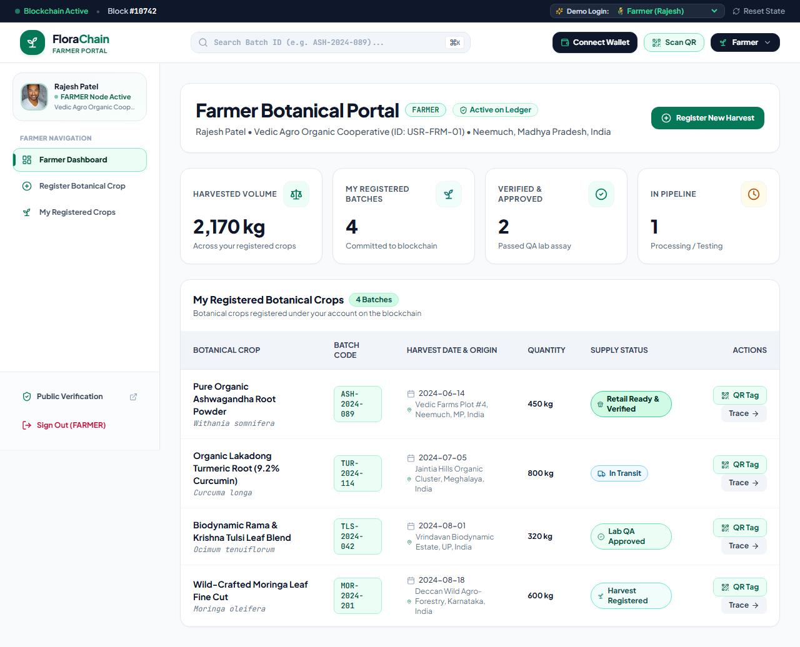
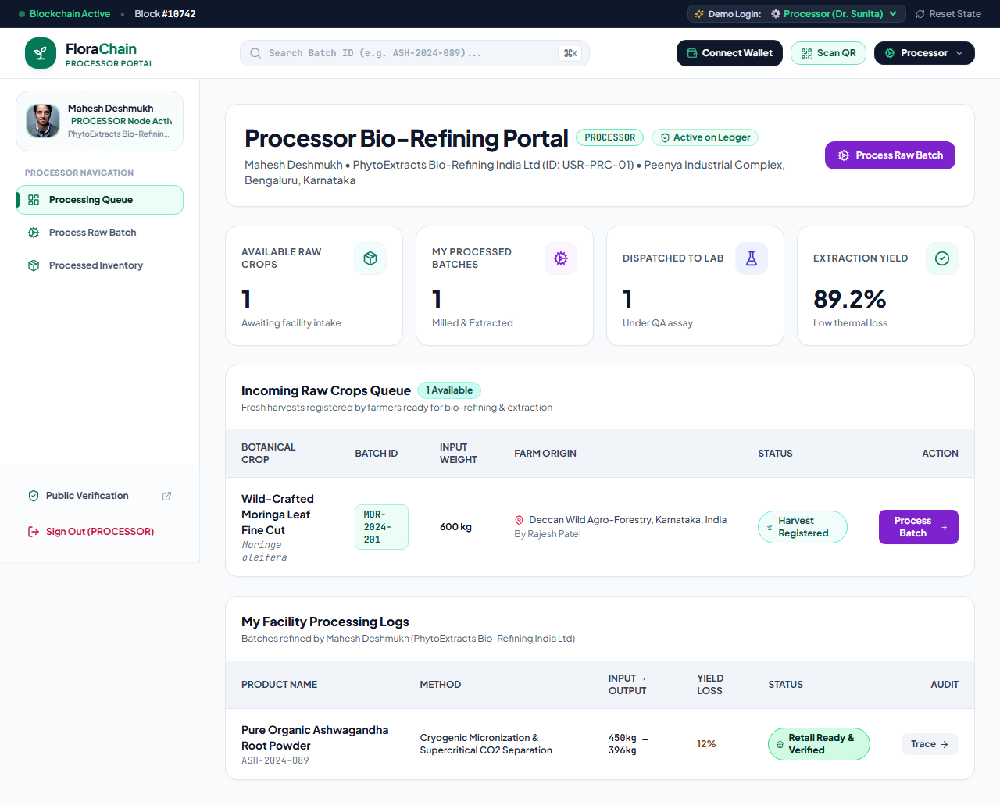
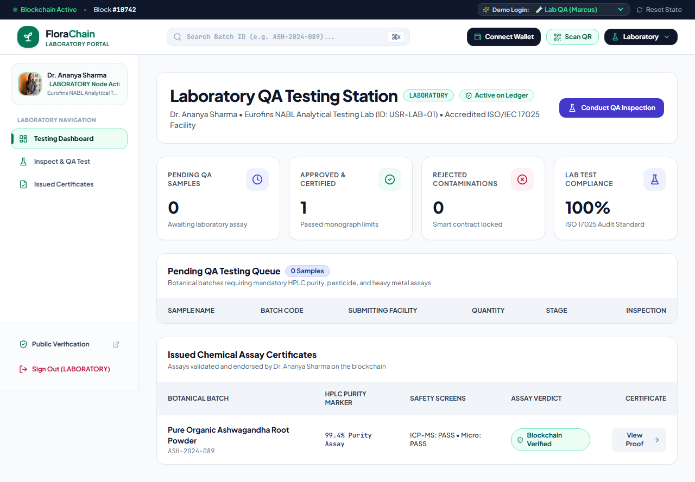
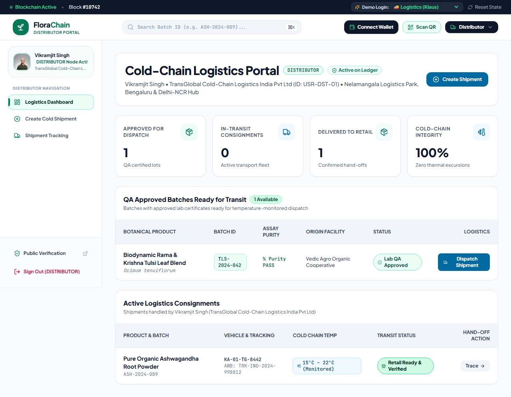
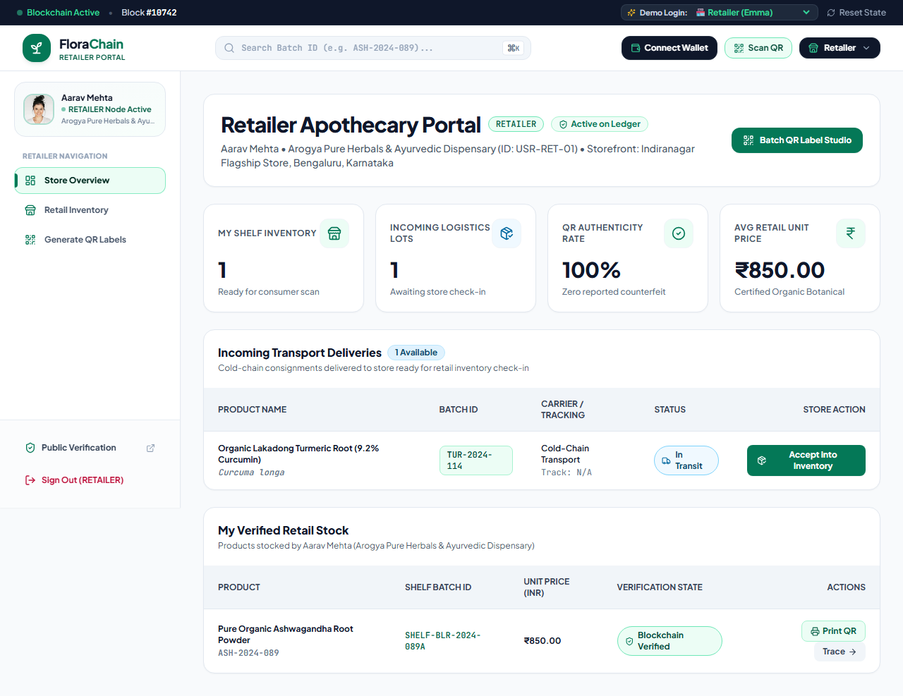
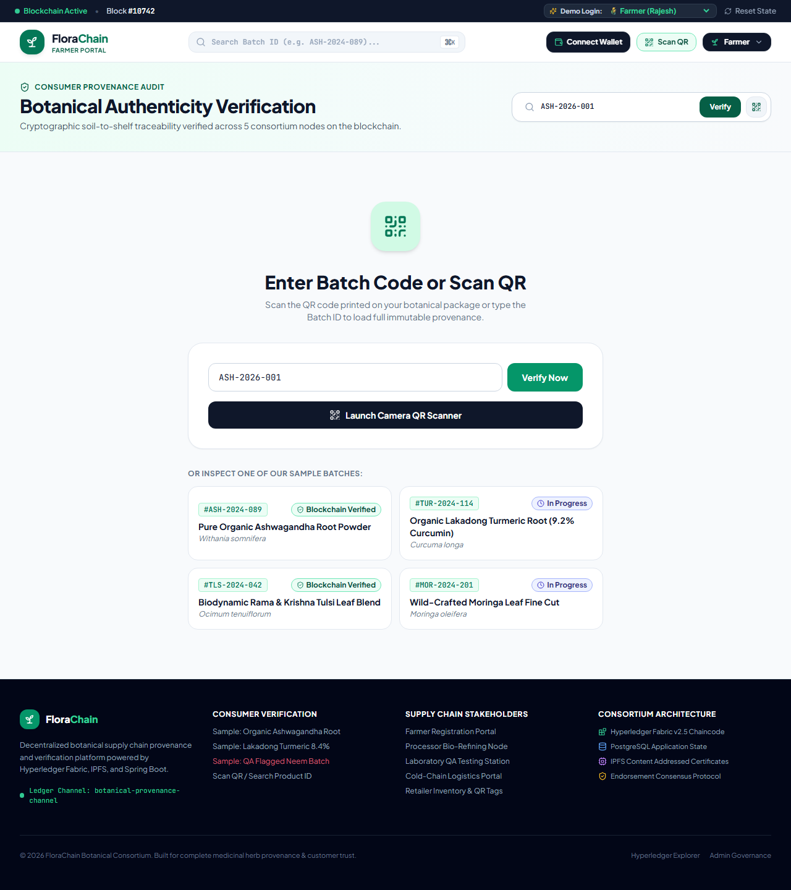

# Botanical Traceability: End-to-End Walkthrough

We successfully simulated the complete lifecycle of a botanical product batch, traversing through every stakeholder node on the supply chain. Using automated testing, we visited the restricted dashboards of the various network participants and concluded with a public authenticity check.

Below is the visual evidence of the supply chain orchestration in action.

## 1. Cultivation (Farmer)
The farmer registers the raw harvest parameters on-chain (e.g., GPS coordinates, organic certification).

---

## 2. Bio-Refining (Processor)
The processing facility receives the raw botanicals and logs the supercritical extraction details, establishing the conversion yield and parameters.

---

## 3. Quality Assurance (Laboratory)
The accredited lab tests the extract for heavy metals, microbial content, and phytoconstituent purity. Only batches that pass the thresholds are approved on the ledger.

---

## 4. Cold-Chain Transit (Distributor)
The distributor logs the environmental transit conditions (temperature, humidity, vehicle ID) to ensure the batch's integrity was not compromised during logistics.

---

## 5. Arrival (Retailer)
The retailer receives the authenticated batch. Having verified its cryptographic chain of custody, a unique consumer-facing QR code is generated.

---

## 6. Public Transparency (Consumer)
The consumer scans the QR code (or types the batch ID) in the public verification portal. The backend queries the smart contract to retrieve the complete lifecycle and calculate the **100% Trust Score**.

### Summary
The automated E2E workflow successfully validated:
- **Role-Based Access Control (RBAC):** Users are securely contained within their permitted operational zones.
- **Smart Contract Interoperability:** Stakeholder actions correctly bridge off-chain events into immutable on-chain records.
- **Data Verifiability:** The consumer receives a transparent and tamper-proof history of the exact product they hold.
